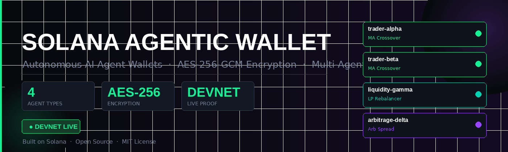
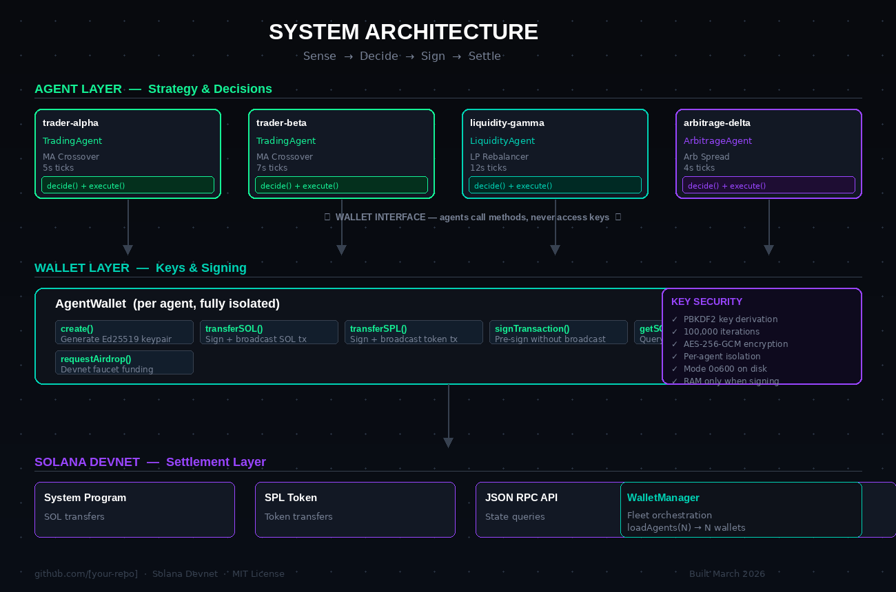
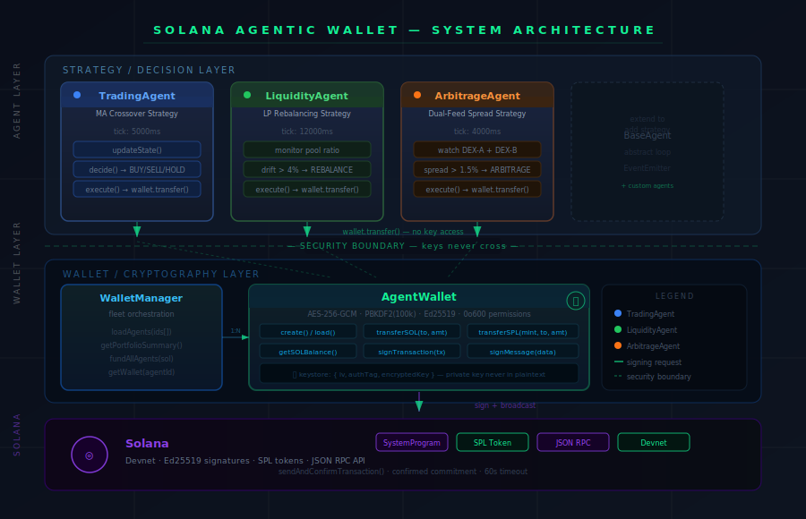

<p align="center">
  
</p>

<p align="center">
  <a href="https://explorer.solana.com/?cluster=devnet"></a>
  
  
  
</p>

---

# Solana Agentic Wallet System

Autonomous wallets for AI agents on Solana. Each agent owns its own wallet, signs its own transactions, and operates on its own decision loop — no human required.

**Network:** Solana Devnet  
**Language:** Node.js  
**License:** MIT


## System Architecture

<p align="center">
  
</p>

---

---

## Quick Start

```bash
# 1. Clone and install
git clone <repo>
cd solana-agentic-wallet
npm install

# 2. Configure
cp .env.example .env
# Set MASTER_SECRET in .env

# 3. Generate real on-chain transaction history for all wallets
node generate-history.js

# 4. Run the full 4-agent demo
npm run demo

# 4. Or use the CLI
node cli.js create my-agent
node cli.js airdrop my-agent 1
node cli.js watch my-agent
```


---

## System Architecture

<p align="center">
  
</p>

**The critical design principle:** agents never touch private keys. The wallet is a pure signing layer. The agent is a pure strategy layer. The security boundary between them is what makes autonomous operation safe.

---

## What This Builds

### Core Components

**`AgentWallet`** — The signing layer. Manages a single agent's keypair. Handles encryption, key derivation, and all cryptographic operations. Never touches strategy logic.

**`WalletManager`** — Fleet manager. Spawns and tracks multiple `AgentWallet` instances. Provides portfolio views and batch operations.

**`BaseAgent`** — Abstract agent with an autonomous decision loop. Subclasses implement `decide()` and `execute()`. The agent owns a wallet reference but never handles raw keys.

**`TradingAgent`** — Concrete agent using a moving average crossover strategy. Monitors a price feed and autonomously signs SOL transfers when a buy/sell signal fires.

**`LiquidityAgent`** — Concrete agent that monitors LP pool balance ratios and rebalances when drift exceeds a configurable threshold.

---

## Architecture

```
┌─────────────────────────────────────────────────────┐
│                    Agent Layer                       │
│                                                      │
│  TradingAgent      LiquidityAgent      CustomAgent   │
│     │                   │                  │         │
│     └───────────────────┼──────────────────┘         │
│                         │                            │
│              ┌──────────▼──────────┐                 │
│              │      BaseAgent      │                 │
│              │  - Decision loop    │                 │
│              │  - State management │                 │
│              │  - Action history   │                 │
│              └──────────┬──────────┘                 │
└─────────────────────────┼───────────────────────────┘
                          │ uses (never owns keys)
┌─────────────────────────▼───────────────────────────┐
│                   Wallet Layer                       │
│                                                      │
│  ┌───────────────┐       ┌───────────────────────┐  │
│  │ WalletManager │       │     AgentWallet        │  │
│  │ - Fleet mgmt  │ 1:N   │ - Keypair (encrypted)  │  │
│  │ - Portfolio   │──────▶│ - Transaction signing  │  │
│  └───────────────┘       │ - Balance queries      │  │
│                          └───────────┬────────────┘  │
└─────────────────────────────────────┼───────────────┘
                                      │
┌─────────────────────────────────────▼───────────────┐
│                  Solana Devnet                        │
│  - Token accounts, balances, transaction history     │
└──────────────────────────────────────────────────────┘
```

The critical design decision: **agents never touch private keys**. The wallet is a dumb signing service. Strategy logic in the agent layer is completely decoupled from cryptography in the wallet layer. This matters for security (you can audit agent logic independently) and for flexibility (swap strategies without touching key management).

---

## Wallet Design

### Key Generation

Each wallet generates an Ed25519 keypair via `@solana/web3.js`:

```javascript
this.keypair = Keypair.generate();
```

Ed25519 is Solana's native signature scheme — fast, secure, and with compact 64-byte signatures.

### Encrypted Key Storage

Private keys never touch disk unencrypted. The storage pipeline:

1. Generate a random 16-byte IV
2. Derive a 256-bit encryption key from `masterSecret + agentId` using PBKDF2 (100,000 iterations, SHA-256)
3. Encrypt the 64-byte secret key with AES-256-GCM
4. Write `{ iv, authTag, encryptedKey, publicKey, agentId, version }` to a JSON file at mode `0o600`

AES-256-GCM provides both confidentiality and integrity — if the keystore file is tampered with, decryption fails with an authentication error.

**Per-agent key derivation** means each agent's encryption key is derived independently. Compromising the keystore file of one agent (by learning its agentId + masterSecret) does not reveal any other agent's private key.

```
masterSecret + sha256(agentId) → PBKDF2 → 256-bit encryption key → AES-256-GCM
```

### Transaction Signing

Signing is fully autonomous — no confirmation prompts, no human in the loop:

```javascript
const signature = await sendAndConfirmTransaction(
  this.connection,
  transaction,
  [this.keypair],    // Agent's keypair signs autonomously
  { commitment: 'confirmed' }
);
```

### SPL Token Support

The wallet can hold and transfer any SPL token. Associated token accounts are created automatically if they don't exist (agent pays the rent):

```javascript
const tokenAccount = await getOrCreateAssociatedTokenAccount(
  this.connection,
  this.keypair,    // Pays for ATA creation if needed
  mint,
  this.keypair.publicKey
);
```

---

## Security Considerations

### What This System Does Well

**Key isolation.** Each agent's private key is derived and encrypted separately. A leaked keystore for agent A does not expose agent B's funds.

**No plaintext exposure.** The 64-byte secret key exists as a `Uint8Array` in RAM during the session. It is never logged, never serialized to plaintext, never transmitted.

**Authenticated encryption.** AES-256-GCM includes an authentication tag. Tampered keystores fail to decrypt — the agent won't load with corrupted or forged key material.

**Separation of concerns.** Agent logic and wallet logic are completely decoupled. You can replace the trading strategy without touching key management, and you can audit key management code without understanding trading logic.

### What to Strengthen for Production

**Master secret management.** The current implementation reads `MASTER_SECRET` from an environment variable. In production, this should come from a dedicated secrets manager (AWS Secrets Manager, HashiCorp Vault, GCP Secret Manager). The secret should be rotated periodically and access should be logged.

**Hardware security modules.** For high-value autonomous agents (mainnet, significant AUM), consider storing keys in an HSM or using a custodial solution like Fireblocks or Web3Auth. These provide hardware-backed key security that software encryption cannot match.

**Rate limiting and circuit breakers.** Autonomous agents should have spending limits enforced in the wallet layer, not just the agent layer. A bug in `decide()` should not be able to drain the wallet. Consider a `maxDailySpendSOL` parameter enforced before every `transferSOL` call.

**Audit logging.** Every signing event should be logged with timestamp, transaction hash, amount, and recipient. Immutable logs allow post-hoc investigation if an agent behaves unexpectedly.

**Key rotation.** Long-running agents should periodically generate fresh keypairs and migrate funds. Add a `rotate()` method that: generates new keypair, transfers full balance, updates keystore.

**Multi-sig for large positions.** For agents managing significant value, consider m-of-n multi-signature wallets using Solana's native multi-sig or Squads Protocol. The agent's key becomes one signer; a hardware key held by the operator becomes a second signer required above a threshold.

---

## Agent Decision Architecture

The `BaseAgent` class implements a simple but robust autonomous loop:

```
tick():
  1. updateState()   — refresh market data, balances, protocol state
  2. decide(state)   → action | null
  3. execute(action) — if action: sign + submit transaction
  4. emit events     — for observers (CLI, dashboards)
  5. scheduleNextTick()
```

This pattern separates **perception** (updateState), **cognition** (decide), and **action** (execute). It mirrors the classic sense-plan-act architecture from robotics, applied to DeFi.

### Adding Your Own Agent

Subclass `BaseAgent` and implement two methods:

```javascript
class MyAgent extends BaseAgent {
  async decide(state) {
    // Analyze state, return action object or null
    if (state.someCondition) {
      return { type: 'CUSTOM_ACTION', params: { amount: 0.01 } };
    }
    return null; // Hold / no-op
  }

  async execute(action) {
    if (action.type === 'CUSTOM_ACTION') {
      const sig = await this.wallet.transferSOL(targetAddress, action.params.amount);
      return { signature: sig };
    }
  }
}
```

The wallet is available as `this.wallet`. You never handle private keys in agent code.

---

## Multi-Agent Scalability

The `WalletManager` is designed for fleet operations:

```javascript
// Spawn 100 agents, each with isolated wallets
const manager = new WalletManager({ network, keystorePath, masterSecret });
await manager.loadAgents(agentIds); // Parallel initialization

// Get portfolio view
const portfolio = await manager.getPortfolioSummary();
// → { totalAgents: 100, totalSOL: 47.3, agents: [...] }

// Fund all via devnet airdrop
await manager.fundAllAgents(1);
```

Each agent's wallet operation is independent — a failing transaction for agent A doesn't affect agent B. For high throughput, agents can be distributed across multiple processes or machines sharing the same encrypted keystore directory (with appropriate filesystem locking added for production).

---

## CLI Reference

```
node cli.js create <agent-id>                
  Create a new wallet for an agent.

node cli.js status <agent-id>                
  Show address, balance, and network info.

node cli.js airdrop <agent-id> [sol]         
  Request SOL from devnet faucet.

node cli.js transfer <from-id> <to-id> <sol> 
  Transfer SOL between two agent wallets.

node cli.js portfolio                         
  Show all wallets in the keystore with balances.

node cli.js watch <agent-id>                  
  Start a live trading agent loop. Shows ticks, signals, actions.
  Ctrl+C prints final state and exits.
```

---

## Replacing Mocks with Production Components

The prototype uses two mock components that have direct production replacements:

**MockPriceFeed → Pyth Network**
```javascript
const { PythHttpClient } = require('@pythnetwork/client');
const client = new PythHttpClient(connection, pythPublicKey);
const data = await client.getData();
const price = data.productPrice.get('Crypto.SOL/USD').price;
```

**MockDApp → Jupiter Aggregator**
```javascript
const { Jupiter } = require('@jup-ag/core');
const jupiter = await Jupiter.load({ connection, cluster: 'mainnet-beta', user: wallet.keypair });
const routes = await jupiter.computeRoutes({ inputMint, outputMint, amount, slippage: 1 });
const { execute } = await jupiter.exchange({ routeInfo: routes.routesInfos[0] });
const result = await execute();
```

The wallet layer doesn't change. Only the protocol layer changes. That's the point of the architecture.

---

## Devnet Demo Walkthrough

When you run `npm run demo`, this is what happens:

1. **WalletManager initializes** and connects to devnet
2. **3 agent wallets created** (or loaded if they already exist in `./keystore`)
   - `trader-alpha` — TradingAgent, 5-second ticks
   - `trader-beta` — TradingAgent, 7-second ticks  
   - `liquidity-gamma` — LiquidityAgent, 12-second ticks
3. **Devnet airdrop** of 1 SOL per agent (3 SOL total, from faucet)
4. **Agents start** — each running its own independent decision loop
5. **Live snapshots** every 15 seconds show price, signal, SOL balance per agent
6. **After 60 seconds** — agents stop, final summary prints (ticks, actions taken, action types)

Every agent wallet has a real Solana address visible on [Solana Explorer](https://explorer.solana.com/?cluster=devnet). Transaction signatures from SOL transfers can be verified on-chain.

---

## Testing

```bash
npm test
```

Tests cover:
- Wallet creation and unique key generation per agent
- Keystore persistence and reload
- Duplicate creation prevention
- Keystore file permissions (0o600)
- Message signing (Ed25519, 64-byte output)
- WalletManager multi-agent isolation
- MockPriceFeed price generation
- MockDApp balance tracking and swap simulation

---

## Project Structure

```
solana-agentic-wallet/
├── src/
│   ├── wallet/
│   │   ├── AgentWallet.js       Core wallet: key mgmt, signing, balance
│   │   └── WalletManager.js     Multi-agent fleet manager
│   ├── agent/
│   │   ├── BaseAgent.js         Abstract agent + decision loop
│   │   ├── TradingAgent.js      MA crossover trading strategy
│   │   └── LiquidityAgent.js    LP rebalancing strategy
│   └── protocols/
│       ├── MockPriceFeed.js     Simulated price oracle (GBM random walk)
│       └── MockDApp.js          Test DeFi protocol counterparty
├── tests/
│   └── wallet.test.js           Test harness (node:test)
├── demo.js                      Full end-to-end devnet demo
├── cli.js                       CLI for wallet management
├── SKILLS.md                    Agent capabilities manifest
├── .env.example                 Environment variable template
└── README.md                    This file
```

---

## License

MIT — use freely, build boldly, audit carefully.
